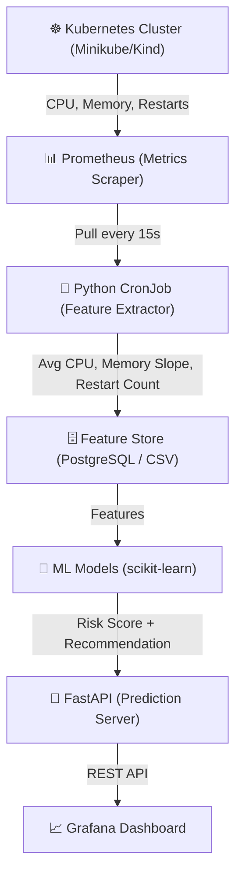

# Kubernetes Health AI — Fresher-Friendly Build Plan
### An AI-Powered Cluster Observability & Predictive Scaling Platform

---

> Let me take you on a journey through this project!
> This isn't just a monitoring tool — it's a complete AI layer on top of your Kubernetes cluster that predicts failures before they happen.

---

## Table of Contents

- [The Big Picture: What We've Created](#the-big-picture-what-weve-created)
- [The Architecture: A Symphony of Modern Tech](#the-architecture-a-symphony-of-modern-tech)
- [Worker (Pod) Monitoring Experience](#worker-pod-monitoring-experience)
  - [Data Collection](#data-collection)
  - [ML Models](#ml-models)
  - [Rule Engine](#rule-engine)
  - [FastAPI Prediction Server](#fastapi-prediction-server)
  - [Grafana Dashboard](#grafana-dashboard)
  - [Design Principles](#design-principles)
  - [System Logic](#system-logic)
- [Tech Stack (Only 5 Things to Learn)](#tech-stack-only-5-things-to-learn)
- [Suggested Build Timeline](#suggested-build-timeline)
- [Architecture Documentation](#architecture-documentation)
- [What to Say in Your Report About Scaling This Up](#what-to-say-in-your-report-about-scaling-this-up)

---

## The Big Picture: What We've Created

Imagine you're running a production Kubernetes cluster.
Pods are crashing, memory is leaking, CPU is spiking — and you find out *after* the outage.

Kubernetes Health AI is your intelligent cluster guardian — an ML-powered observability platform that:

- Watches every pod with real-time Prometheus metrics
- Detects CPU spikes and memory leaks before they cause failures
- Recommends scaling actions in plain English
- Serves predictions instantly via a REST API
- Displays everything on a live Grafana dashboard

---

## The Architecture: A Symphony of Modern Tech

> A system designed not just to observe your cluster,
> but to predict and prevent failures before they occur.

---

## Worker (Pod) Monitoring Experience

[ Metrics Collection ] → [ Feature Extraction ] → [ ML Scoring ] → [ Dashboard ]

---

| Stage | Description | Experience |
|---|---|---|
| Metrics Scraping | Prometheus pulls kubelet + kube-state-metrics | Automatic, every 15s |
| Feature Extraction | Python CronJob builds per-pod features | Runs every few minutes |
| Feature Store | PostgreSQL table or CSV | Simple and queryable |
| Prediction | Isolation Forest + Linear Regression | Trains in seconds |

---

**Isolation Forest** — CPU/Memory Spike Detection
- Unsupervised — no labeled failure data needed
- Flags anomalous resource usage per pod
- Works out of the box on collected metrics

**Trend Detection** — Memory Leak Detection
- Simple linear regression on memory-over-time
- A leak = sustained upward slope, not a single spike
- Catches gradual degradation before it crashes the pod

---

**Flow:**
ML Signal → Rule Engine → Plain-English Recommendation

- "CPU usage trending toward limit — consider increasing replicas from 3 to 5"
- "Memory leak detected in pod `payments-7d9f` — investigate or restart"
- "All systems nominal — no action required"

---

- REST endpoint: `GET /predict/{pod_name}`
- Returns risk score + scaling recommendation
- A working API in ~30 lines of Python
- Queryable by Grafana, Slack, or any dashboard

---

### Risk Level
- Low: Pod is healthy
- Medium: Anomaly detected, monitor closely
- High: Immediate action recommended

### Pod Metrics
- Average CPU usage vs. limit
- Memory slope over time
- Restart count in the last window

### Alerts
- Optional Slack webhook fires when a pod is flagged high-risk

---

- No deep learning required — scikit-learn only
- No labeled failure data needed to get started
- Runs entirely on a laptop (Minikube/Kind)
- Modular — swap any component as you scale
- Production upgrade path clearly defined

---

Cluster Metrics → Feature Engineering → ML Scoring → REST API → Live Dashboard

---

## Tech Stack (Only 5 Things to Learn)

| Concern | Technology | Why it's beginner-friendly |
|---|---|---|
| Metrics collection | Prometheus | One Helm chart install, huge documentation, industry standard |
| Feature scripting | Python + pandas | You likely already know this |
| ML models | scikit-learn (Isolation Forest + linear regression) | No deep learning needed, trains in seconds on a laptop |
| Serving | FastAPI | A working REST API in ~30 lines of code |
| Dashboard | Grafana | Drag-and-drop panels, no frontend code required |

Everything else from the full enterprise version (Kafka, Spark/Flink, Elasticsearch, Airflow, custom Kubernetes Operator) is worth **mentioning as "future work"** in your report — it shows you understand how this would scale in production — but you don't need to build any of it.

---

## Suggested Build Timeline

| Week | Task |
|---|---|
| 1 | Set up a local cluster (Minikube/Kind), install Prometheus + Grafana via Helm, confirm you can see live metrics |
| 2 | Write the Python feature-extraction script, run it manually first, then wrap it as a CronJob |
| 3 | Train Isolation Forest on the collected features; get it flagging obvious spikes (you can simulate load with a stress-test pod) |
| 4 | Add the trend-detection memory leak check |
| 5 | Wrap both models in a FastAPI endpoint |
| 6 | Wire FastAPI into a Grafana panel (or Streamlit app); add Slack alert as a stretch goal |
| 7 | Polish, write up the report, add the "how this scales in production" section referencing Kafka/Spark/Airflow as future work |

---

## Architecture Documentation

For comprehensive technical details about the system design, including:

- Data flow diagrams with component interactions
- Feature engineering pipeline and schema
- ML model training and inference details
- FastAPI endpoint specifications

👉 [View Complete Architecture Documentation](architecture_diagram.png)

---

## What to Say in Your Report About Scaling This Up

Explicitly call out the production path — evaluators like seeing that you understand the tradeoffs you made:

- Replace the CronJob with a real streaming pipeline (Kafka + Spark/Flink) to handle continuous high-volume clusters
- Replace the Isolation Forest baseline with an LSTM/Autoencoder once you have enough historical data
- Add a supervised failure classifier (XGBoost) once real failure events have been logged over time
- Automate retraining with Airflow instead of manual reruns
- Close the loop with a custom Kubernetes Operator that can act on recommendations automatically (behind manual approval for safety)

---

## Prometheus Alerting + Alertmanager Integration

KubeGuard AI supports native Kubernetes alerting via Prometheus Operator CRDs. Alerting rules are packaged as a `PrometheusRule` resource in the `kubeguard` namespace.

### Alerts Configurations

| Alert Name | Expression | Duration | Severity | Description |
|---|---|---|---|---|
| **KubeGuardHighRiskPod** | `kubeguard_pod_risk_score >= 60` | `2m` | `critical` | Fires when a pod has a risk score indicating immediate action is required |
| **KubeGuardPodAnomaly** | `kubeguard_pod_anomaly == 1` | `2m` | `critical` | Fires when Isolation Forest detects statistical resource anomalies |
| **KubeGuardMemoryGrowth** | `kubeguard_pod_memory_trend_bytes_per_second > 1000` | `2m` | `critical` | Fires when memory leak is detected (sustained memory trend > 1000 B/s) |
| **KubeGuardCPUTrend** | `kubeguard_pod_cpu_trend > 0.0001` | `2m` | `critical` | Fires when CPU rate exhibits a positive trend slope > 0.0001 cores/s |
| **KubeGuardPodRestart** | `kubeguard_pod_restart_count >= 4` | `2m` | `critical` | Fires when a pod reaches critical restart counts (restarts >= 4) |

### Discovery & Routing Flow
1. **Rule Discovery**: The Prometheus Operator dynamically discovers the KubeGuard rules via label matching: `release: kube-prometheus-stack`.
2. **Reload**: Rules are synced into Prometheus configuration files and evaluated.
3. **Alert Routing**: Firing alerts are sent to Alertmanager. *Note: External notifications (Slack, email, Webhooks) are not configured at this stage.*

### Verification Steps
1. **Healthy State**: Deploy normal workloads (e.g. `demo-nginx`). Confirm that no alerts are pending/firing.
2. **Controlled Firing**: Deploy a load generation pod (`cpu-stress` or `memory-growth` in `kubeguard-test` namespace). Verify that KubeGuard detects the trend, raises the metric value, and Prometheus transitions the alert to `PENDING` and then `FIRING`.
3. **Automatic Resolution**: Delete the stress workload. KubeGuard stale metric cleanup purges the defunct series. Prometheus rules evaluate to empty and automatically resolve the alerts.

