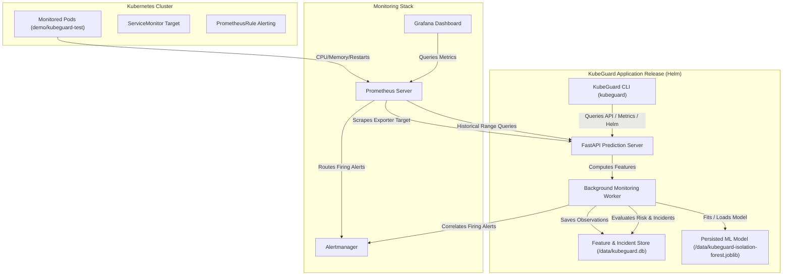

# KubeGuard AI — Kubernetes Workload Health & Risk Observatory

[](file:///c:/Saravanakumar%20G/Projects/Kubernets-cloud%20kyro/KubeGuard/helm/kubeguard/Chart.yaml)
[](file:///c:/Saravanakumar%20G/Projects/Kubernets-cloud%20kyro/KubeGuard/helm/kubeguard/Chart.yaml)
[](file:///c:/Saravanakumar%20G/Projects/Kubernets-cloud%20kyro/KubeGuard/cli/README.md)
[](file:///c:/Saravanakumar%20G/Projects/Kubernets-cloud%20kyro/KubeGuard/LICENSE)

---

## What is KubeGuard?

**KubeGuard AI** is an AI-assisted Kubernetes workload health and risk monitoring application (Kubernetes-native MVP / production-oriented prototype). It continuously monitors Kubernetes workloads, detects resource anomalies and degradation trends, calculates operational risk scores, and correlates alerts into actionable incident contexts.

KubeGuard:
- **Collects Telemetry**: Scrapes Kubernetes workload metrics via Prometheus (`kubelet` + `kube-state-metrics`).
- **Feature Engineering**: Computes CPU rate, memory usage, restart counts, and linear trend slopes (bytes/sec and cores/sec).
- **Unsupervised Anomaly Detection**: Uses Isolation Forest models (`scikit-learn`) to detect statistical resource anomalies without manual baseline labels.
- **Rule Engine**: Combines ML anomaly signals with deterministic operational rules to produce a 0–100 risk score and `LOW`, `MEDIUM`, or `HIGH` risk levels.
- **Continuous Background Monitoring**: Periodically evaluates configured target namespaces.
- **Event & Incident Correlation**: Correlates ML signals, metric trends, and Prometheus Alertmanager alerts into persistent incident records with chronological timeline state events.
- **Persistent Storage & WAL Mode**: Stores historical feature observations, atomic versioned ML models (`joblib`), and incident history using persistent storage (`PersistentVolumeClaim` / SQLite in WAL mode).
- **Self-Observability**: Exposes internal operational telemetry (`kubeguard_*` metrics) for Prometheus/Grafana and tracks background worker health.
- **Security Hardened**: Container runs as dedicated non-root user (`UID 10001`) with dropped capabilities (`drop: [ALL]`).
- **Operator CLI**: Includes a command-line interface (`kubeguard`) for installation, status checking, pod risk inspection, and incident tracking.

> [!IMPORTANT]
> **KubeGuard is NOT a Python library.** It is distributed as a Kubernetes-native application using a container image and a Helm chart.

---

## How KubeGuard is Distributed

KubeGuard cleanly separates developer artifact packaging from end-user cluster installation:

```text
Developer / Build Side                                   User Cluster Deployment
──────────────────────                                   ───────────────────────
KubeGuard Source Code
        │
        ├──► Docker Container Image ──► Container Registry ──┐
        │    (kubeguard-prediction-service:0.1.6)           │
        │                                                    ▼
        └──► Helm Chart Packaging   ──► Helm Repository ──► Helm Release (Deployment / PVC)
             (helm/kubeguard)                                │
                                                             ▼
                                                    KubeGuard Operator CLI
                                                    (kubeguard)
```

- **Developer Workflow**: Source code is containerized into a lightweight Docker image (`kubeguard-prediction-service:0.1.6`) and packaged into a versioned Helm chart (`helm/kubeguard`).
- **User Installation**: Site Reliability Engineers (SREs) and cluster operators deploy KubeGuard into any Kubernetes cluster using `helm install` or the `kubeguard` CLI — without needing Python runtime setups or building container images.

---

## System Architecture




---

## Key Capabilities & Core Modules

### 1. ML Model Lifecycle & Telemetry Store
KubeGuard accumulates real cluster telemetry over time to transition from a bootstrap baseline to a custom historical model:
- **Bootstrap Model**: Fresh deployments initialize an Isolation Forest model using synthetic perturbation fallback so anomaly scoring functions immediately.
- **Historical Feature Store**: Routine monitoring scans record pod feature vectors in an embedded SQLite database (`/data/kubeguard.db`).
- **Historical Model Training**: When stored observations cross `MIN_TRAINING_SAMPLES` (default: 50), KubeGuard automatically fits a historical model on real workload behavior.
- **Model Artifact Persistence**: Fitted models are saved via `joblib` (`/data/kubeguard-isolation-forest.joblib`) with version metadata. Data persists across pod restarts via a Kubernetes `PersistentVolumeClaim`.

For details, see [docs/MODEL_LIFECYCLE.md](file:///c:/Saravanakumar%20G/Projects/Kubernets-cloud%20kyro/KubeGuard/docs/MODEL_LIFECYCLE.md).

---

### 2. Event Correlation & Incident Context
KubeGuard transforms isolated risk signals and Prometheus alerts into coherent incident contexts:
- **Signal Correlation**: Combines resource trend slopes, restart spikes, and ML anomaly results into active signals.
- **Deduplication**: Active incidents are uniquely identified by `(namespace, pod)`. Multiple monitoring cycles update the same ongoing active incident.
- **Timeline Generation**: Emits chronological state transition events (`incident_created`, `risk_escalated`, `ml_anomaly_detected`, `alert_fired`, `incident_resolved`).
- **Alertmanager Integration**: Correlates firing and resolved Prometheus alerts with active pod incidents.
- **Resolution Grace Period**: Configurable grace window (`INCIDENT_RESOLUTION_GRACE_SECONDS=120`) prevents incident flapping on transient scrape drops.

For details, see [docs/INCIDENT_CORRELATION.md](file:///c:/Saravanakumar%20G/Projects/Kubernets-cloud%20kyro/KubeGuard/docs/INCIDENT_CORRELATION.md).

---

### 3. KubeGuard Self-Observability
KubeGuard monitors workloads AND exposes operational telemetry describing its own internal health:
- **Centralized Configuration**: Strict environment variable parsing and validation (`config.py`) with startup summary logging.
- **Structured Logging**: Configurable text or JSON log formatting (`LOG_FORMAT=text|json`).
- **Self-Metrics**: 21 internal `kubeguard_*` Prometheus metrics tracking monitoring cycles, prediction latency, feature store records, model provenance, worker health, and active incidents.
- **Readiness Probe**: Dedicated `GET /ready` probe verifying background worker thread health.
- **Operational Self-Alerting**: PrometheusRules for worker health (`KubeGuardWorkerDown`), cycle failures (`KubeGuardMonitoringFailures`), and prediction failures (`KubeGuardPredictionFailures`).

For details, see [docs/OBSERVABILITY.md](file:///c:/Saravanakumar%20G/Projects/Kubernets-cloud%20kyro/KubeGuard/docs/OBSERVABILITY.md).

---

## Installation & Operator Guide

### Option A: Installation via KubeGuard CLI (Recommended)

#### 1. Install CLI
```bash
cd cli
pip install .
```

#### 2. Deploy KubeGuard Release
```bash
# Perform pre-flight checks and install KubeGuard via Helm
kubeguard install --interval 30 --namespaces demo,kubeguard-test
```

#### 3. Inspect Cluster & Incident Status
```bash
# Check installation and worker health status
kubeguard status

# View monitored pod risk scores
kubeguard pods
kubeguard pods --risk high

# Inspect active correlated incidents
kubeguard incidents

# View detailed timeline and signals for an incident
kubeguard incidents --id <incident-id>

# View active Alertmanager alerts
kubeguard alerts
```

---

### Option B: Direct Helm Chart Installation

Deploy KubeGuard into the `kubeguard` namespace:

```bash
helm install kubeguard helm/kubeguard \
  --namespace kubeguard \
  --create-namespace \
  --set monitoring.intervalSeconds=30 \
  --set monitoring.namespaces="demo,kubeguard-test"
```

To uninstall:
```bash
helm uninstall kubeguard --namespace kubeguard
```

---

## Development Roadmap & Status Summary

| Phase | Description | Status |
|---|---|---|
| 1 | Prometheus Connectivity & Collector setup | **Completed** |
| 2 | Feature engineering & linear regression trends | **Completed** |
| 3 | Isolation Forest ML anomaly validation | **Completed** |
| 4 | FastAPI Prediction Server and Pydantic models | **Completed** |
| 5 | Continuous background Monitoring worker and Exporter Gauges | **Completed** |
| 6 | PrometheusRule alerts configuration & Alertmanager routing | **Completed** |
| 7 | Reusable Helm Chart packaging & dynamic parameter overrides | **Completed** |
| 8 | Command-Line Interface (`kubeguard`) management layer | **Completed** |
| 9 | Historical Feature Store (SQLite) & Model Lifecycle (`joblib`) | **Completed** |
| 10 | Configuration & Observability Hardening (Self-Metrics, JSON Logs, Alerts) | **Completed** |
| 11 | Event Correlation & Incident Context (Signals, Timeline, Alertmanager) | **Completed** |

---

## Technical Documentation Index

- [docs/INCIDENT_CORRELATION.md](file:///c:/Saravanakumar%20G/Projects/Kubernets-cloud%20kyro/KubeGuard/docs/INCIDENT_CORRELATION.md) — Event correlation, timeline events, and Alertmanager integration.
- [docs/OBSERVABILITY.md](file:///c:/Saravanakumar%20G/Projects/Kubernets-cloud%20kyro/KubeGuard/docs/OBSERVABILITY.md) — Self-observability metrics, configuration, structured logging, and worker health.
- [docs/MODEL_LIFECYCLE.md](file:///c:/Saravanakumar%20G/Projects/Kubernets-cloud%20kyro/KubeGuard/docs/MODEL_LIFECYCLE.md) — Feature store, baseline training, versioning, and persistence.
- [cli/README.md](file:///c:/Saravanakumar%20G/Projects/Kubernets-cloud%20kyro/KubeGuard/cli/README.md) — Command-line interface usage and options.
- [kubernetes/manifests/README.md](file:///c:/Saravanakumar%20G/Projects/Kubernets-cloud%20kyro/KubeGuard/kubernetes/manifests/README.md) — Test workload definitions and PrometheusRule manifests.
