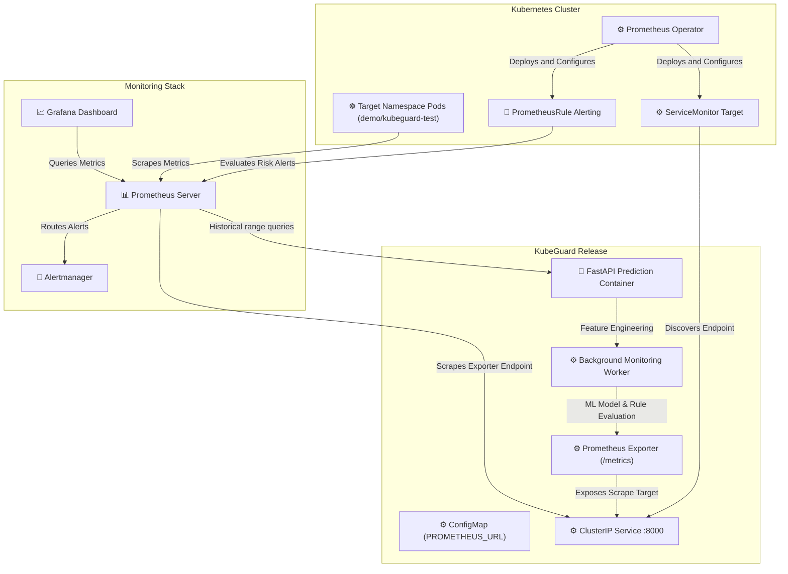

# System Architecture

The following diagram shows the high-level architecture of KubeGuard AI components up to Helm Packaging (Step 13):

## Architectural Decoupling

- **PrometheusClient**: Holds connection setup, status verification, and raw HTTP query execution.
- **Collector**: Focuses purely on instant cluster states (pod discovery, current metrics, restart counts).
- **Feature Service**: Focuses on historical trends (time-series sample collection, statistical aggregations, regression slope computation).
- **Prediction Orchestration**: Links Feature Service pipelines, Isolation Forest classifiers, and Rule Engine logic into atomic scoring evaluations.
- **Monitoring Worker**: Executes scanning loops in a background thread to decouple FastAPI REST response time from cluster evaluation durations.
- **Prometheus Integration**: Exposes metrics endpoints and triggers rules configurations natively using Operator definitions.
- **Helm Release Packaging**: Standardizes installation using a unified parameter values configuration.

