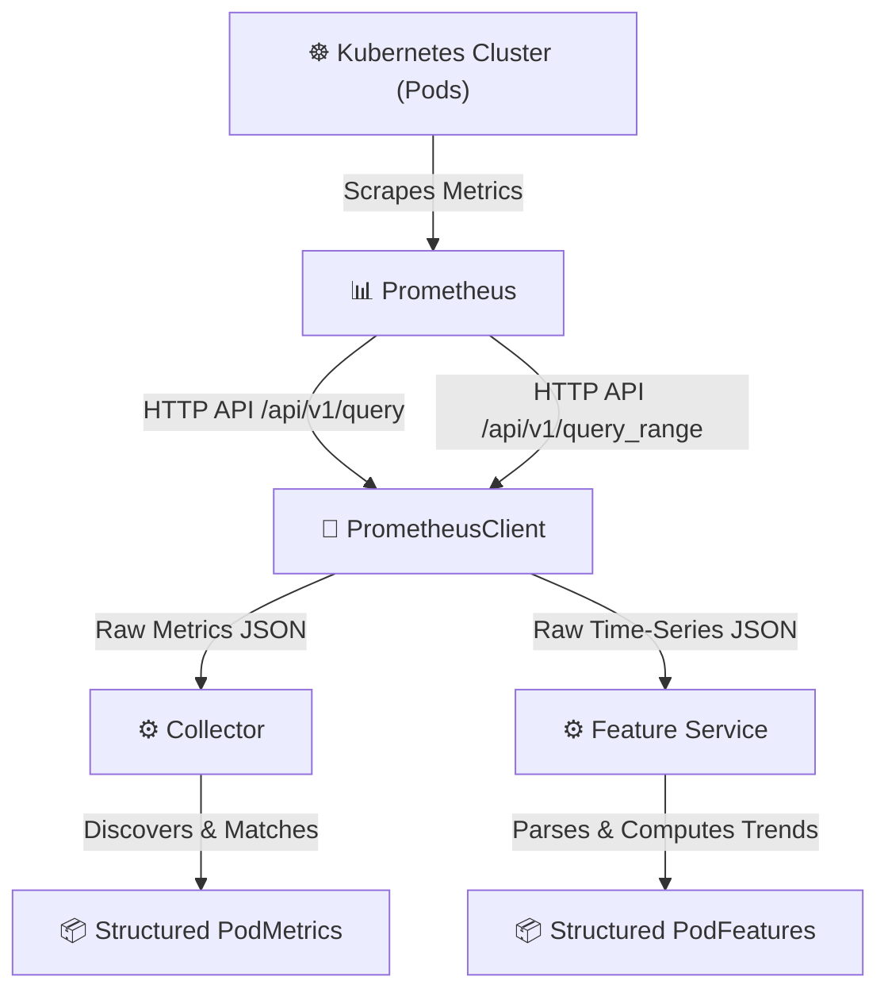

# System Architecture

The following diagram shows the high-level architecture of the components implemented so far:

## Architectural Decoupling

- **PrometheusClient**: Holds connection setup, status verification, and raw HTTP query execution.
- **Collector**: Focuses purely on instant cluster states (pod discovery, current metrics, restart counts).
- **Feature Service**: Focuses on historical trends (time-series sample collection, statistical aggregations, regression slope computation).
