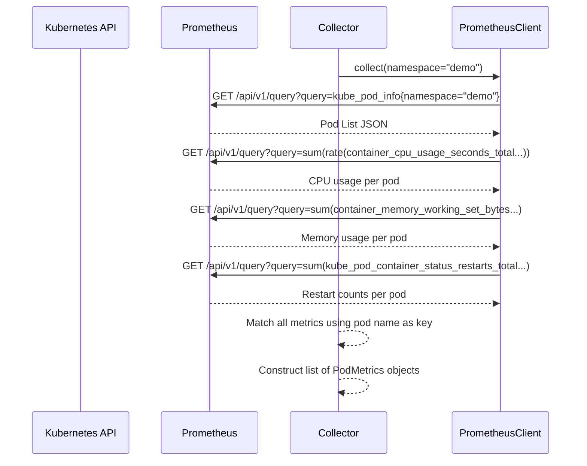
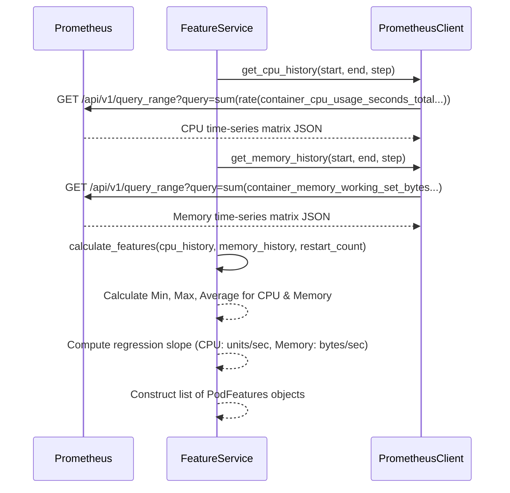

# Data Flow

The following describes how metrics transit and transform inside KubeGuard AI:

---

## 1. Instant Metric Collection Flow
This flow is run periodically to check the immediate health of the cluster.

---

## 2. Feature Calculation Flow
This flow runs to gather historical metrics for training or live machine learning model evaluation.

