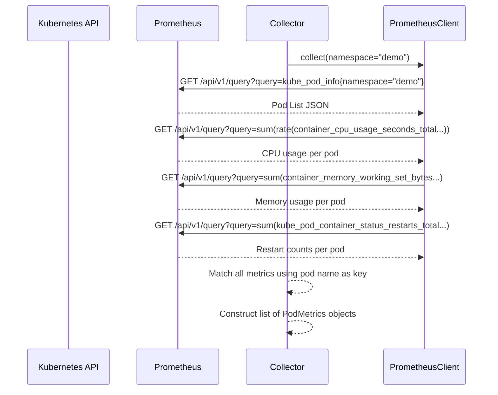
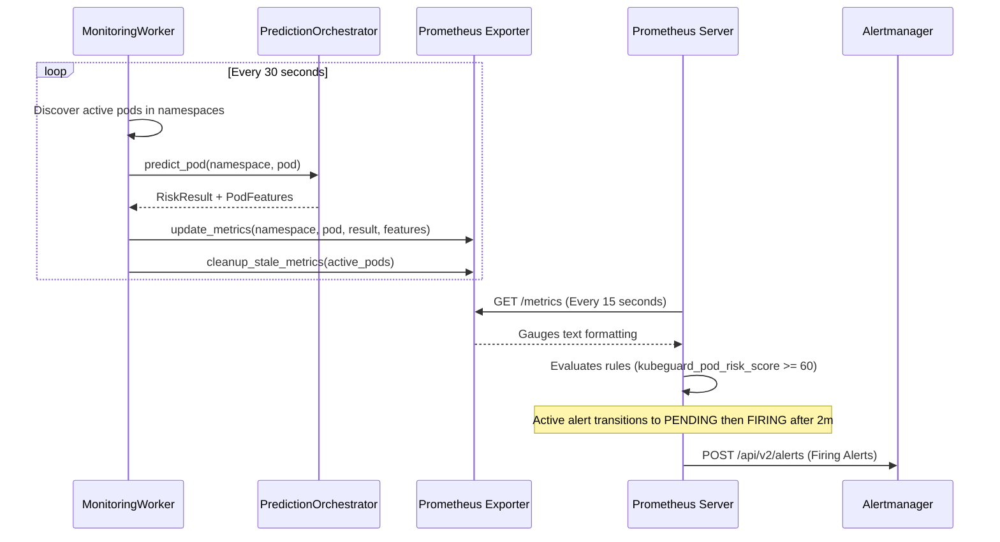

# Data Flow

The following describes how metrics transit and transform inside KubeGuard AI:

---

## 1. Instant Metric Collection Flow
This flow is run periodically to check the immediate health of the cluster.



---

## 2. Feature Calculation Flow
This flow runs to gather historical metrics for training or live machine learning model evaluation.

```mermaid
sequenceDiagram
    participant Prom as Prometheus
    participant FS as FeatureService
    participant PC as PrometheusClient

    FS->>PC: get_cpu_history(start, end, step)
    PC->>Prom: GET /api/v1/query_range?query=sum(rate(container_cpu_usage_seconds_total...))
    Prom-->>PC: CPU time-series matrix JSON
    FS->>PC: get_memory_history(start, end, step)
    PC->>Prom: GET /api/v1/query_range?query=sum(container_memory_working_set_bytes...)
    Prom-->>PC: Memory time-series matrix JSON
    FS->>FS: calculate_features(cpu_history, memory_history, restart_count)
    FS-->>FS: Calculate Min, Max, Average for CPU & Memory
    FS-->>FS: Compute regression slope (CPU: units/sec, Memory: bytes/sec)
    FS-->>FS: Construct list of PodFeatures objects

---

## 3. Prediction & Scoring Flow
This sequence shows how client API requests or background evaluations process data to grade risk levels.

```mermaid
sequenceDiagram
    participant API as FastAPI /predict
    participant Orch as PredictionOrchestrator
    participant Coll as Collector
    participant FS as FeatureService
    participant AD as AnomalyDetector
    participant RE as RuleEngine

    API->>Orch: predict_pod(namespace, pod)
    Orch->>Coll: collect(namespace)
    Coll-->>Orch: PodMetrics
    Orch->>FS: calculate_features(history, restarts)
    FS-->>Orch: PodFeatures
    Orch->>AD: predict(PodFeatures)
    AD-->>Orch: anomaly_detected (True/False)
    Orch->>RE: evaluate(PodFeatures, anomaly_detected)
    RE-->>Orch: RiskResult (Score, Level, Recommendations)
    Orch-->>API: RiskResult JSON
```

---

## 4. Background Monitoring & Alerting Flow
The continuously running worker loop fetches cluster metrics, updates exporter Gauges, and fires alerts.



```
